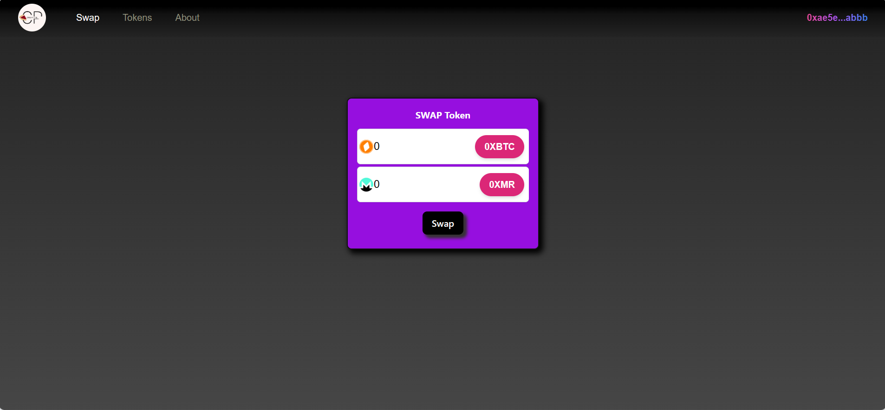

<a name="readme-top"></a>


<!-- PROJECT LOGO -->
<br />
<div align="center">
  <a href="https://github.com/MrSingh2000/CreamPie-Swap">
    
  </a>

  <h3 align="center">Cream Pie Swap</h3>

  <p align="center">
    DeFi app based on Uniswap Protocol
    <br />
    <a href="https://creampie-swap.netlify.app/">View Demo</a>
    ·
    <a href="https://github.com/MrSingh2000/CreamPie-Swap/issues">Report Bug</a>
    ·
    <a href="https://github.com/MrSingh2000/CreamPie-Swap/issues">Request Feature</a>
  </p>
</div>

<!-- TABLE OF CONTENTS -->
<details>
  <summary>Table of Contents</summary>
  <ol>
    <li>
      <a href="#about-the-project">About The Project</a>
      <ul>
        <li><a href="#built-with">Built With</a></li>
      </ul>
    </li>
    <li>
      <a href="#getting-started">Getting Started</a>
      <ul>
        <li><a href="#prerequisites">Prerequisites</a></li>
        <li><a href="#installation">Installation</a></li>
      </ul>
    </li>
    <li><a href="#contact">Contact</a></li>
  </ol>
</details>

<!-- ABOUT THE PROJECT -->

## About The Project

<a href="https://creampie-swap.netlify.app/">

</a>

DeFi app based on Uniswap Protocol, deployed on Polygon Mumbai Network (Ethereum Blockchain)

Features covered :-

- Connect Metamask wallet.
- Swap any tokens available on the network according to the liquidity pool (be sure to be on Mumbai network).
- Get details of top tokens and pools as per their Volume.
- List of tokens available on the connected network chain.

If you wanna add your taste to the existing application, feel free to fork the repo and just start working on your local machine!

<p align="right">(<a href="#readme-top">back to top</a>)</p>

### Built With
<!-- Solidity, Hardhat, Openzepplin, React Tailwind-->

- [](https://docs.soliditylang.org/)
- [](https://www.openzeppelin.com/)
- [](https://reactjs.org/)
- [](https://hardhat.org/)
- [](https://uniswap.org/)

### Other Technologies

- [](https://tailwindcss.com/)
- [](https://redux.js.org/)
- [](https://vitejs.dev/)

<p align="right">(<a href="#readme-top">back to top</a>)</p>

<!-- GETTING STARTED -->

## Getting Started

Set up the project locally on your system following instructions on setting up your project.
To get a local copy up and running, follow these simple steps.

### Prerequisites

Installing latest Package Manager

- npm
  ```sh
  npm install npm@latest -g
  ```
- yarn
  ```sh
  yarn install yarn@latest -g
  ```

### Installation

1. Clone the repo
   ```sh
   git clone https://github.com/MrSingh2000/g-drive_2.0.git
   ```
2. Installing required packages
    
   Server 
   ```sh
   npm install
   ```
   Client 
   ```sh
   cd client
   npm install
   ```

3. Setting up environment variables for client in `.env`
   ```txt
   VITE_CONTRACT_ADDRESS = 'your_deployed_contract_address_here'
   VITE_QUOTER_ADDRESS = 'uniswap_quoter_address_here'
   ```

4. Start the application

   client
   ```sh
   cd client
   npm run dev
   ```

Note: You can also use Genache or start hardhat node for local development. Please refer to respective documentation for details.

<p align="right">(<a href="#readme-top">back to top</a>)</p>

<!-- CONTACT -->

## Contact

[](https://www.linkedin.com/in/anshuman-singh-856991201/)

[](https://github.com/MrSingh2000)

[](https://www.instagram.com/mr_singh2000/)

<p align="right">(<a href="#readme-top">back to top</a>)</p>

<!-- MARKDOWN LINKS & IMAGES -->
<!-- https://www.markdownguide.org/basic-syntax/#reference-style-links -->

[contributors-shield]: https://img.shields.io/github/contributors/MrSingh2000/weather-app-android.svg?style=for-the-badge
[contributors-url]: https://github.com/MrSingh2000/weather-app-android/graphs/contributors
[forks-shield]: https://img.shields.io/github/forks/MrSingh2000/weather-app-android.svg?style=for-the-badge
[forks-url]: https://github.com/MrSingh2000/weather-app-android/network/members
[stars-shield]: https://img.shields.io/github/stars/MrSingh2000/weather-app-android.svg?style=for-the-badge
[stars-url]: https://github.com/MrSingh2000/weather-app-android/stargazers
[issues-shield]: https://img.shields.io/github/issues/MrSingh2000/weather-app-android.svg?style=for-the-badge
[issues-url]: https://github.com/MrSingh2000/weather-app-android/issues
[license-shield]: https://img.shields.io/github/license/MrSingh2000/weather-app-android.svg?style=for-the-badge
[license-url]: https://github.com/MrSingh2000/weather-app-android/blob/master/LICENSE.txt
[linkedin-shield]: https://img.shields.io/badge/-LinkedIn-black.svg?style=for-the-badge&logo=linkedin&colorB=555
[linkedin-url]: https://linkedin.com/in/othneildrew
[product-screenshot]: readme/spash.jpg
[product-homepage]: readme/2.jpg
[native]: https://img.shields.io/badge/ReactNative-20232A?style=for-the-badge&logo=react&logoColor=61DAFB
[react.js]: https://img.shields.io/badge/React-20232A?style=for-the-badge&logo=react&logoColor=61DAFB
[react-url]: https://reactjs.org/
[native-url]: https://reactnative.dev/
